# THM-pickle-rick Write-up
🥒 This is write-up for TryHackMe **Pickle Rick** Room

> This is my first public write-up.
> English isn't my first language, so please excuse any grammar mistakes.

---

<h2>Room Link</h2>
[Pickle Rick] - (https://tryhackme.com/room/picklerick)
   
<h3 align="center">--- Objective ---</h3>

- Find three ingredients by exploiting the web server provided in this room
 
<h3 align="center">--- Approach ---</h3>
1. Enumeration : 
The easiest way to gather information about a web server is to retrieve its content, so we start there.

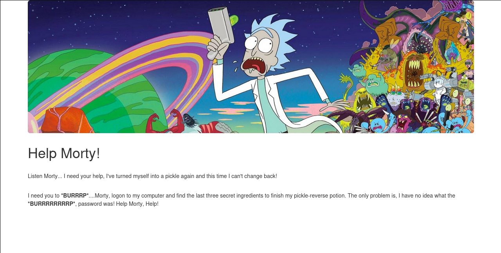
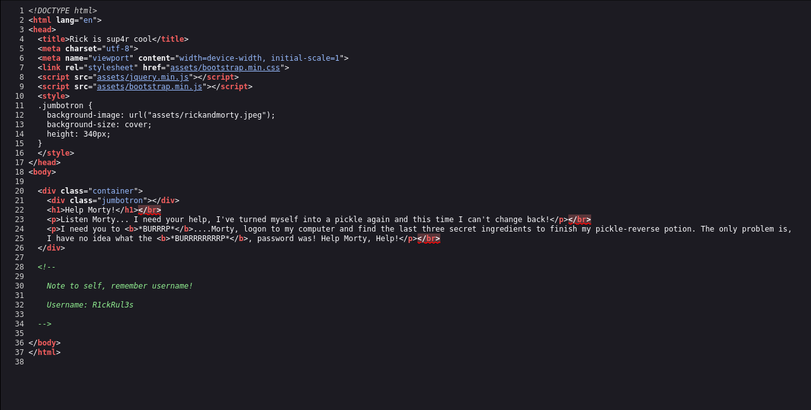

The HTML page source reveals a username that we might be able to use elsewhere. This is a good start!

Next, I use some tool to reveal hidden content of this web server. I ran an nmap script to explore pages and directories.

Command: `nmap --script discovery <web url> -p80`

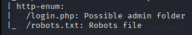

The screenshot shows that it has robots.txt and login.php . The robots.txt file often gives useful clues about a site's structure, so I checked it first.

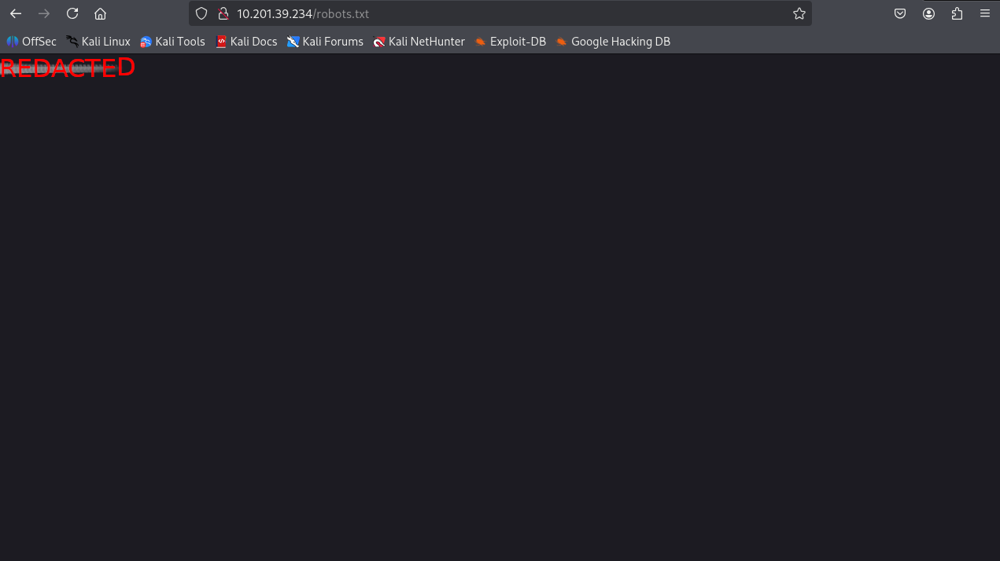

The robots file content looked like a gibberish at first, so I continued to login.php  

2. Sensitive Data Explosure

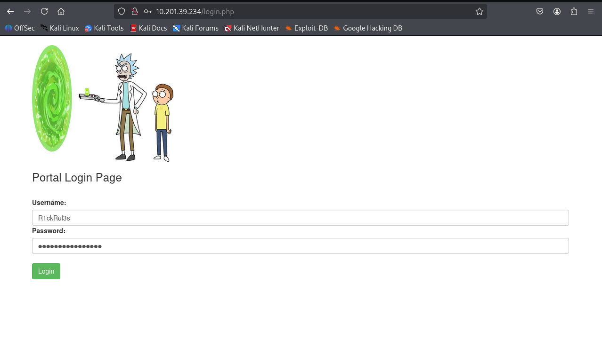

The login requires both username and password. I suspected the username is the one we got from the idex page source 
`Username: R1ckRul3s` 
I didn't know the password, so I tried brute-forcing with rockyou and Seclist wordlists, but it didn't work. 
I then tried the gibberish from robots.txt and it was the password.  

3. Remote Code Execution

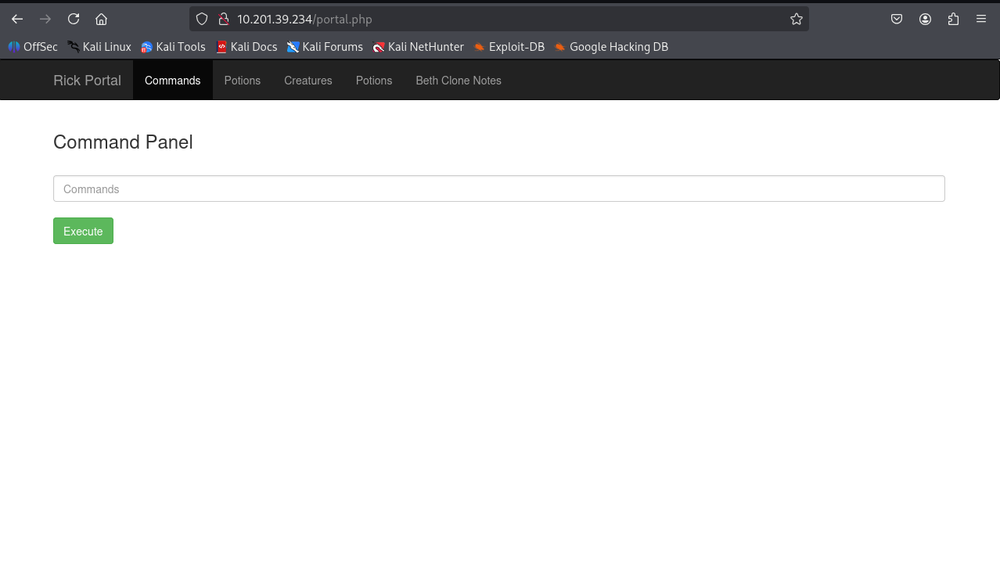

There is a form that executes command on target machine.

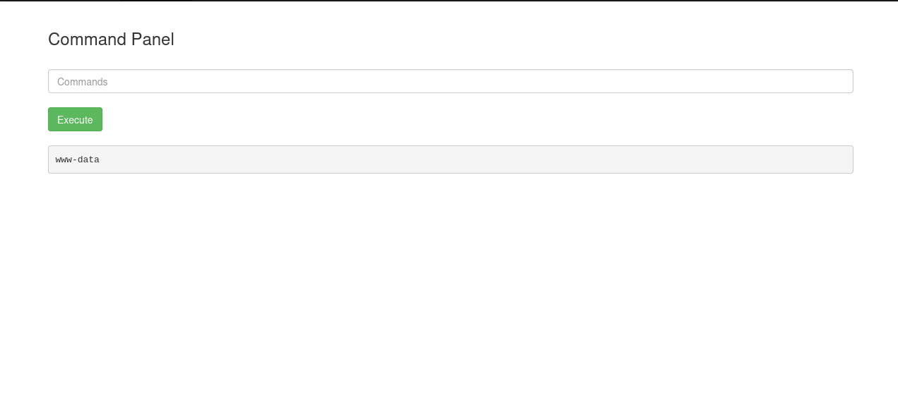

We're running as www-data.

I started by listing current directory.

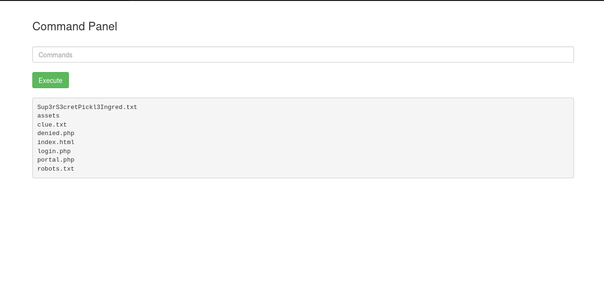

We found Sup3rS3cretPickl3Ingred.txt, which might be the first flag. But when I tried to get content of the file.

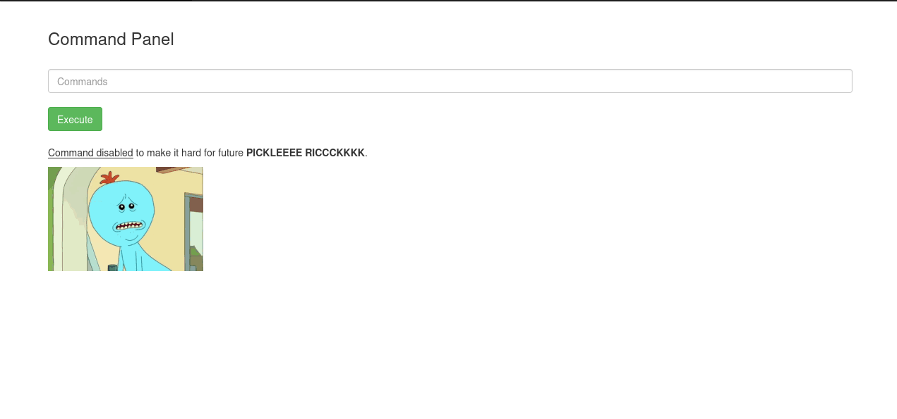

It seem we cannot execute this command. My guess was I might be able to execute this but with user with right privilege or the command `cat` is restricted.
 
I checked if there are any privilege misconfiguration and I got
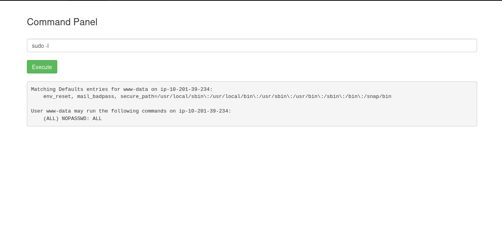
We could run commands as root (No password).
 
Now I tried running `cat` as root
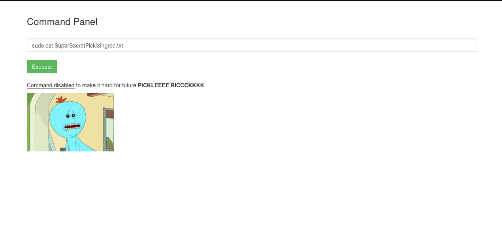
Now it's confirmed that we cannot run `cat`. So how can we read the file?
 
There are many ways to extract file contents for example:
Command: `base64 Sup3rS3cretPickl3Ingred.txt | base64 -d`
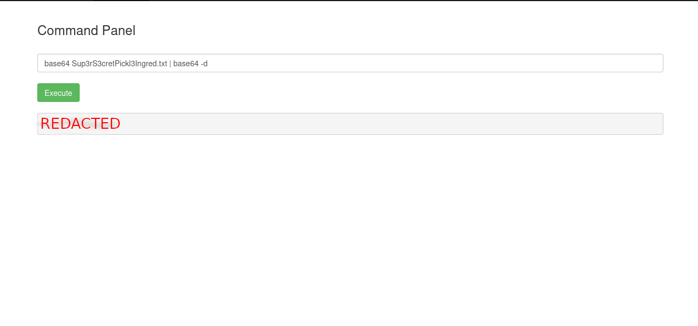

With this, we can easily get the first ingredient.
And I also check clue.txt in the directory.

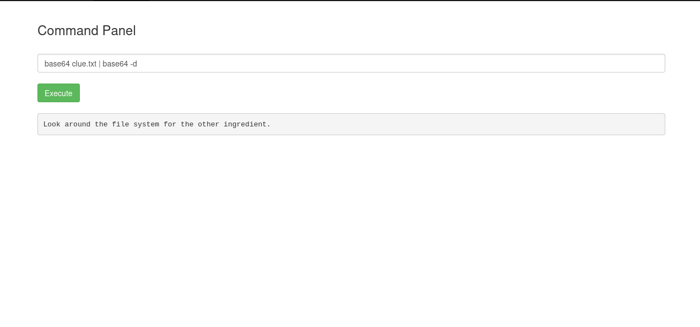

This suggests all ingredient are stored somewhere in the filesystem.
Next I checked the home directory (It's common to store flag in home directory)

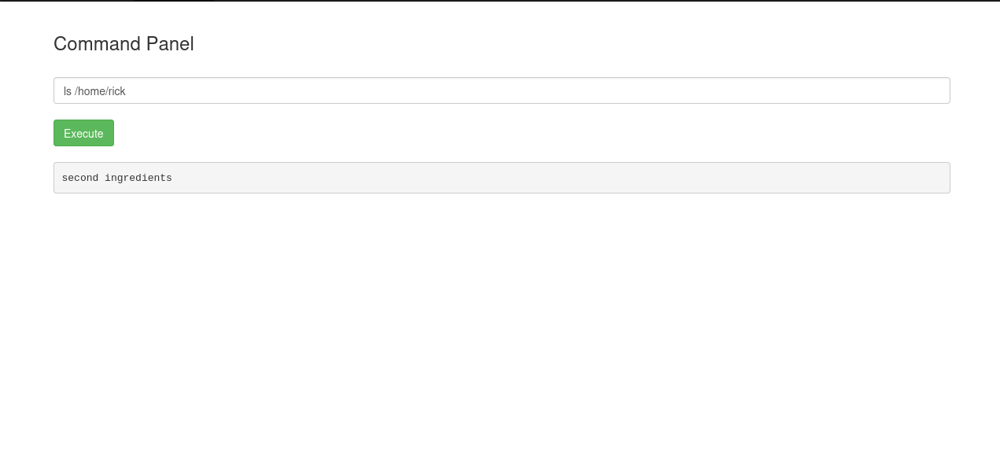
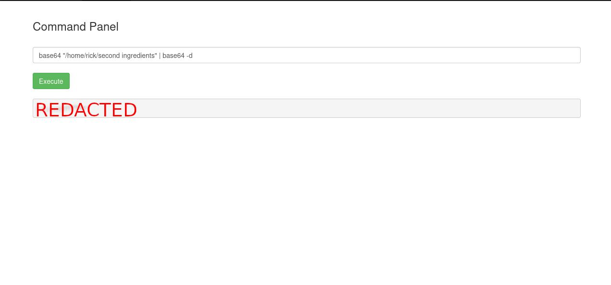

This gave the second flag. I looked for the last flag in other home directory but found nothing, 
so I go back to root of file system.

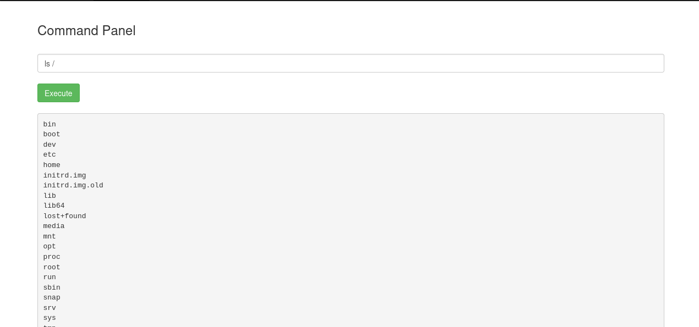

The last flag might be in a root-only location so I checked /root directory
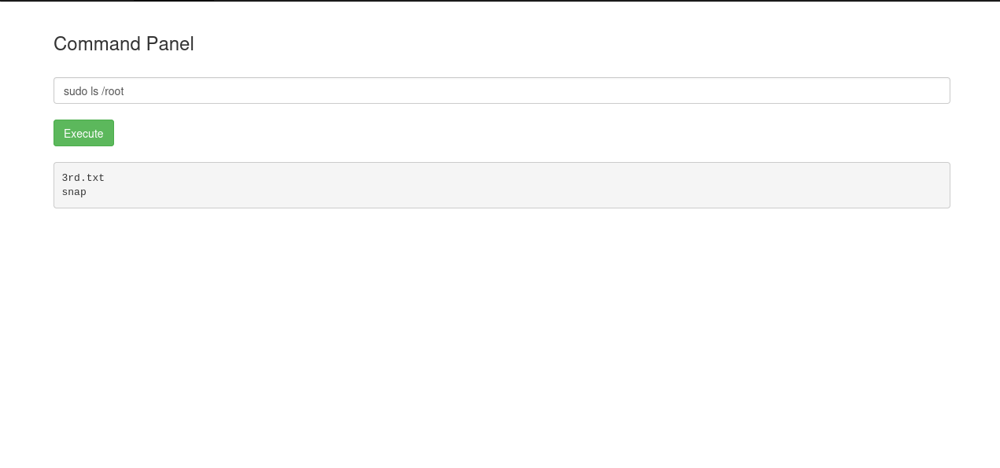
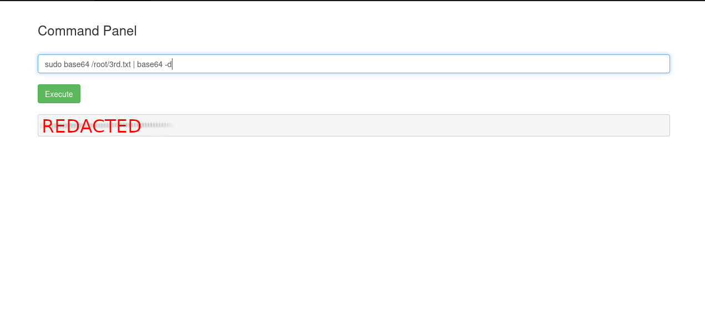

<h3 align="center">--- Conclusion ---</h3>
Pickle Rick room is an enjoyable room that reinforces enumeration and basic Linux command skills. The web shell helps skip some steps, making the room beginner-friendly. If you're new to CTFs or web enumeration, this room is a good introduction.
